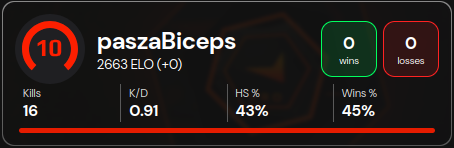

# FACEIT Stats Widget

 

Widget for **[OBS Studio](https://obsproject.com/)** that displays **[FACEIT](https://faceit.com)** stats. (ELO, level,
ELO gain/loss, average stats)

### 🔗 [Generator](https://widget.mxgic1337.xyz/)

## 🖼️ Preview:

## 🔧 Getting started:

To get started, generate your widget link at [this website](https://widget.mxgic1337.xyz/). Then, add a new
browser source in OBS Studio and paste your generated link.

> [!NOTE]  
> It is recommended to set the Browser Source width to around 500px.

This project is not affiliated with [FACEIT](https://faceit.com).
